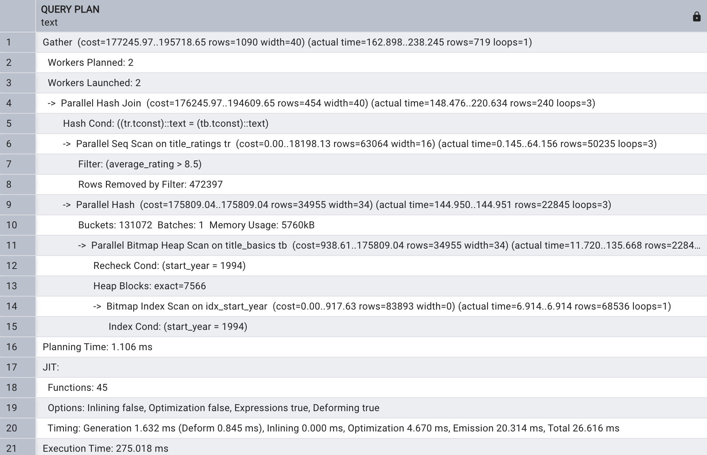
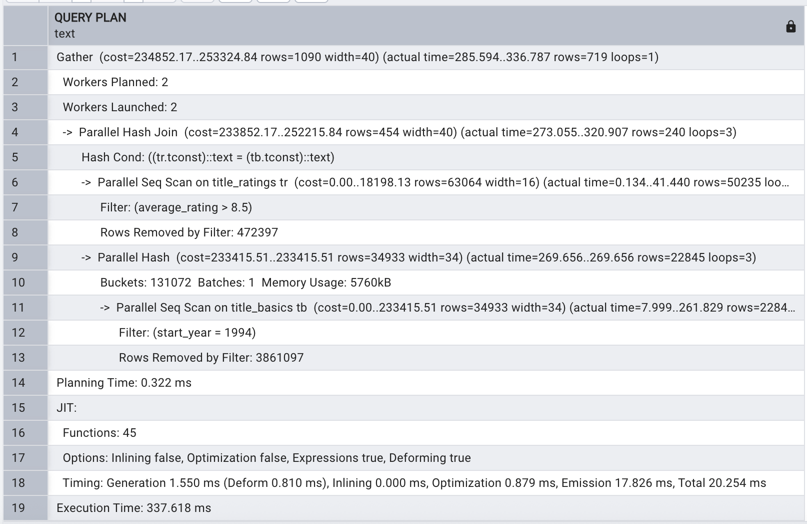

# Exercice 3: Jointures et filtres

3.1) Requête avec EXPLAIN ANALYZE qui joint les tables title_basics et title_ratings pour trouver 
le titre et la note des films sortis en 1994 ayant une note moyenne supérieure à 8.5

EXPLAIN ANALYSE
SELECT
	   tb.tconst,
       tb.primary_title,
       tb.start_year,
       tr.average_rating
FROM title_basics AS tb
INNER JOIN title_ratings AS tr ON tb.tconst = tr.tconst
WHERE tb.start_year = 1994 and tr.average_rating > 8.5;

3.2) Analyse du plan de jointure
  1. L'algorithme de jointure utilisé est ``Parallel Hash Join``
  2. L'index start_Year n'est utilisé.
  3. La condition sur average_Rating est utilisée comme filtre dans le Parallel Seq Scan sur title_ratings, donc les lignes sont filtrées après lecture séquentielle
  4. PostgreSQL utilise le parallélisme pour améliorer les performances des requêtes lourdes, en répartissant le travail entre plusieurs processus de travail sur des cœurs CPU différents car les données sont très volumineuses.

3.3) Indexation de la seconde condition 
CREATE INDEX idx_average_rating ON title_ratings (average_rating);

3.4) Analyse après indexation 
La requete semble plus rapide
Avant indexation

Après indexation

3.5)  Analyse de l’impact
 1. La jointure de base n'a pas changé.
 2. l'index *average_Rating* n'est pas utilisé. On observe un Parallel Seq Scan sur title_ratings: PostgreSQL lit toutes les lignes de title_ratings et filtre en mémoire les lignes avec une note > 8.5
 
 3. OUI, le temps d'exécution s'est amélioré
 
 **Avant indexation** ==> 337.6 ms             
 **Avant indexation** ==> 275.0 ms

 4. Postgres peut abandonner le paralélisme si le volume données à traiter n'est pas conséquent et peut par conséquent plus coûteux.

 # Exercice 5: Recherche ponctuelle

 5.1) une requête avec EXPLAIN ANALYZE qui recherche le titre et la note d'un film spécifique en 
utilisant son identifiant (tconst = 'tt0111161')

 EXPLAIN ANALYZE
SELECT tb.primary_title, tr.average_rating
FROM title_basics tb
JOIN title_ratings tr ON tb.tconst = tr.tconst
WHERE tb.tconst = 'tt0111161';

 5.2) Analyse du plan
    1. L'algorithme  jointure utilisé est Nested Loop Join 
    2. les index sur tconst etant des clés primaire permettent un accès direct à la ligne dans chaque table sans avoir à scanner quoi que ce soit
    3. La comparaison entre la requête 5 (recherche ponctuelle) et les requêtes précédentes, notamment la requête 3 (jointure avec filtres), montre une  amélioration considérable des performances. Alors que la requête 3 nécessitait un temps d’exécution compris entre 275 et 337 ms, la requête 5 s’exécute en moins d’une milliseconde à environ 1 ms, soit une amélioration considérable. Cette différence s’explique par le nombre de lignes examinées : la requête 3 parcourt plus de 100 000 lignes avec un Parallel Hash Join, tandis que la requête 5 se limite à une seule ligne grâce à l’utilisation d’un index sur la clé tconst, permettant un Nested Loop Join extrêmement rapide. L’optimisation repose ici sur la nature très sélective de la requête ponctuelle, qui cible un enregistrement unique et bénéficie des index présents, contrairement aux requêtes plus générales nécessitant des filtres sur de larges volumes de données.

    4. Cette requête est rapide car:
    - La recherche est très sélective (clé primaire/clé unique).
    - Utilisation d’index sur tconst dans les deux tables
    - Pas besoin de parallélisme, de hash join ni de filtres complexes.

